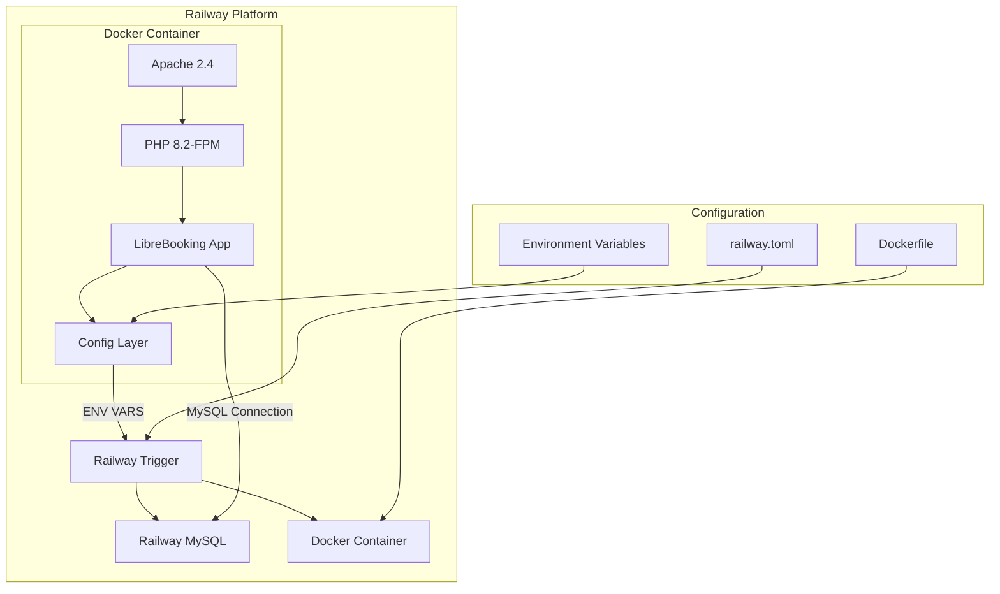

# Design Document: Railway Deployment and Russian Localization

## Overview

Данный документ описывает архитектуру и технические решения для развёртывания LibreBooking на Railway и полной русификации интерфейса. Решение включает создание Docker-контейнера с PHP 8.2+, Apache, необходимыми расширениями и конфигурацией для Railway, а также дополнение русской локализации.

## Architecture



### Deployment Flow

1. Railway читает `railway.toml` для конфигурации деплоя
2. Docker-образ собирается из `Dockerfile`
3. Railway автоматически создаёт MySQL базу данных
4. Переменные окружения передаются в контейнер
5. Приложение запускается и подключается к базе данных

## Components and Interfaces

### 1. Dockerfile

Создаёт образ на базе `php:8.2-apache` с необходимыми расширениями:
- `pdo_mysql` - подключение к MySQL
- `gd` - работа с изображениями
- `intl` - интернационализация
- `zip` - работа с архивами
- `opcache` - кэширование PHP

### 2. Railway Configuration (railway.toml)

```toml
[build]
builder = "dockerfile"
dockerfilePath = "Dockerfile"

[deploy]
startCommand = "apache2-foreground"
healthcheckPath = "/Web/"
healthcheckTimeout = 100
restartPolicyType = "on_failure"
```

### 3. Apache Configuration

- DocumentRoot: `/var/www/html/Web`
- mod_rewrite включён для ЧПУ
- AllowOverride All для .htaccess

### 4. Entrypoint Script

Скрипт инициализации:
1. Создаёт директории для логов и загрузок
2. Устанавливает права доступа
3. Проверяет подключение к БД
4. Запускает миграции при первом запуске

### 5. Russian Localization Files

| Компонент | Путь | Описание |
|-----------|------|----------|
| Языковой файл | `lang/ru_ru.php` | Все строки интерфейса |
| Email-шаблоны | `lang/ru_ru/*.tpl` | 20 шаблонов писем |

## Data Models

### Environment Variables Mapping

| Railway Variable | LibreBooking Variable | Description |
|-----------------|----------------------|-------------|
| `MYSQL_HOST` | `LB_DATABASE_HOSTSPEC` | Database host |
| `MYSQL_DATABASE` | `LB_DATABASE_NAME` | Database name |
| `MYSQL_USER` | `LB_DATABASE_USER` | Database user |
| `MYSQL_PASSWORD` | `LB_DATABASE_PASSWORD` | Database password |
| `RAILWAY_PUBLIC_DOMAIN` | `LB_SCRIPT_URL` | Public URL |

### Russian Locale Configuration

```php
$dates['general_date'] = 'd.m.Y';
$dates['general_datetime'] = 'd.m.Y H:i:s';
$dates['schedule_daily'] = 'l, d.m.Y';
```

## Correctness Properties

*A property is a characteristic or behavior that should hold true across all valid executions of a system-essentially, a formal statement about what the system should do. Properties serve as the bridge between human-readable specifications and machine-verifiable correctness guarantees.*

### Property 1: Environment Variable Configuration
*For any* environment variable defined in Railway, when the application reads configuration, it SHALL use the environment variable value instead of the default config value.
**Validates: Requirements 1.5**

### Property 2: Russian Translation Completeness
*For any* string key present in the English language file (`en_us.php`), the Russian language file (`ru_ru.php`) SHALL contain a corresponding translation for that key.
**Validates: Requirements 3.2, 4.1, 4.2**

### Property 3: Email Template Parity
*For any* email template file present in `lang/en_us/`, there SHALL exist a corresponding Russian template file in `lang/ru_ru/` with the same filename.
**Validates: Requirements 3.3, 4.3**

## Error Handling

### Database Connection Errors

```php
try {
    $pdo = new PDO($dsn, $user, $password);
} catch (PDOException $e) {
    error_log("Database connection failed: " . $e->getMessage());
    http_response_code(503);
    die("Сервис временно недоступен. Пожалуйста, попробуйте позже.");
}
```

### Missing Translation Fallback

Если строка отсутствует в русском переводе, система использует английский вариант (наследование от `en_gb`).

## Testing Strategy

### Unit Tests

1. **Configuration Tests**: Проверка чтения переменных окружения
2. **Localization Tests**: Проверка загрузки языковых файлов

### Property-Based Tests

Используем PHPUnit для property-based тестирования:

1. **Translation Completeness Test**
   - Генерируем список всех ключей из английского файла
   - Проверяем наличие каждого ключа в русском файле
   - Минимум 100 итераций не требуется (детерминированный тест)

2. **Email Template Parity Test**
   - Получаем список всех файлов в `lang/en_us/`
   - Проверяем существование соответствующих файлов в `lang/ru_ru/`

### Integration Tests

1. **Docker Build Test**: `docker build -t librebooking-test .`
2. **Container Start Test**: Проверка запуска контейнера
3. **Database Connection Test**: Проверка подключения к MySQL

### Manual Testing Checklist

- [ ] Деплой на Railway успешен
- [ ] Интерфейс отображается на русском
- [ ] Email-уведомления на русском
- [ ] Даты в русском формате (дд.мм.гггг)
